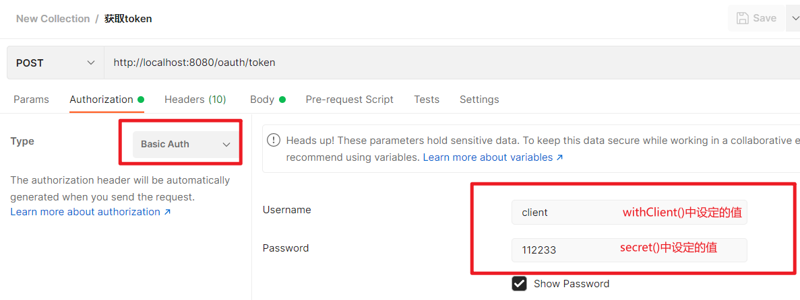
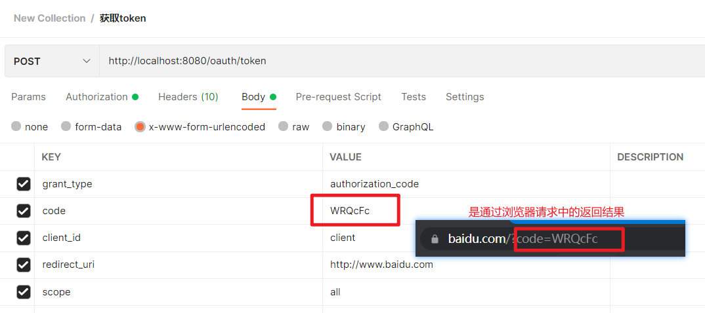
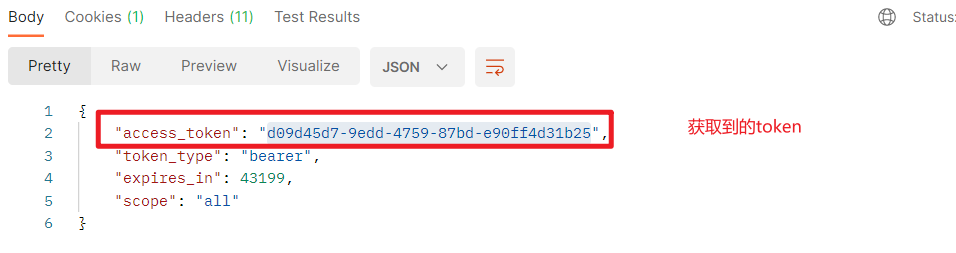
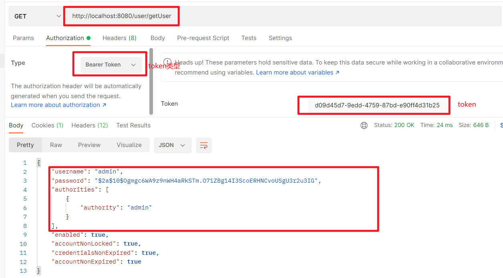

该模块主要实现了授权码模式

1、获取请求码code（GET请求，在浏览器完成）

`http://localhost:8080/oauth/authorize?response_type=code&client_id=client&redirect_uri=http://www.baidu.com&scope=all`

参数说明：

response_type:响应类型

client_id:客户端ID

redirect_uri:回调地址

scope:授权范围

2、获取token（POST请求，课使用Postman工具完成请求）

3、资源请求

